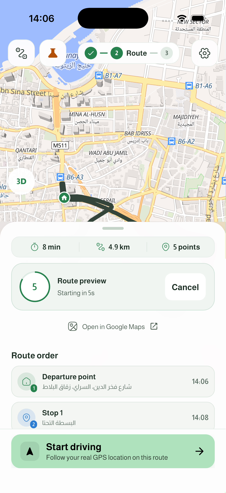
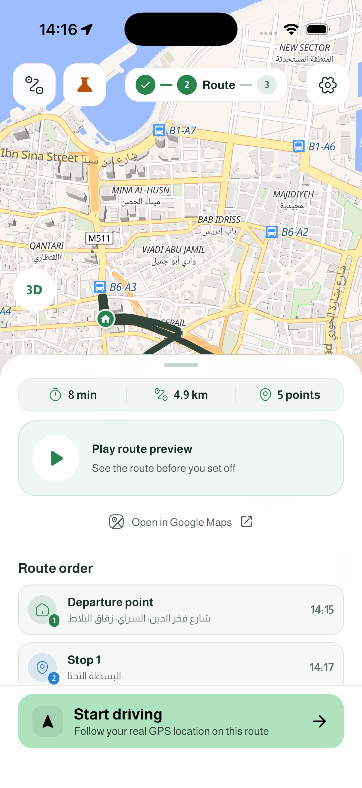

# Automatic route preview

The route sheet gives playback its own mint card with a circular countdown or a clear play triangle. **Open in Google Maps** sits below as a separate text action with an external-link icon. **Start driving** remains the pinned primary action. Playback has no disclosure chevron, so it no longer suggests opening another list.

## Behavior

- An explicit successful multi-stop plan requests one automatic preview. The five-second countdown begins after the native map has applied that route, its camera and its markers.
- The countdown reads **Route preview · Starting in 5s**, counts down to one, and opens the panoramic Overview mode.
- Touching or scrolling anywhere, tapping **Cancel**, leaving the page, backgrounding the app, editing, or starting driving consumes the request. The card becomes **Play route preview · See the route before you set off**.
- Exiting playback never starts another countdown. Restored routes, saved routes and quiet background reroutes remain manual. A new explicit plan returns the sheet to the top so its countdown is visible.
- **Settings → Trip → Auto-preview new routes** defaults on and persists the user's choice. Reduce Motion or screen-reader navigation keeps playback manual. Routes with missed time windows or an approximate stop order also remain manual so their warnings can be read.
- English, Arabic and French labels are included. Cancel has a 48-point target; the play card is an accessible button. Layout checks cover Arabic RTL and 180% text on a narrow screen.

## Simulator review

| Countdown | After cancellation or exit |
| --- | --- |
|  |  |

The iPhone 17 / iOS 26.5 simulator showed the complete 5 → 4 → 3 → 2 → 1 countdown followed by automatic Overview playback. Cancel, exit without another countdown, and the settings switch were checked. The user's existing three-stop Beirut route was preserved. The local nine-second recording is `.codex-ui-screenshots/auto-preview-demo.mp4`.

## Verification

- **529 tests passed** in the full Flutter suite. Coverage includes native-map readiness, a stale readiness callback, cancellation at the timer deadline, changed routes, warning banners, restoration, quiet reroutes, settings persistence, backgrounding, covered pages, Reduce Motion and screen-reader navigation.
- The suite and final static analysis are recorded in `.codex-ui-screenshots/auto-preview-full-tests-final.log` and `auto-preview-analyze-final.log`.
- Static analysis has the same five existing findings: one unused geocoding parameter and four dangling test documentation comments. No new findings.
- Seven affected visual references were reviewed, including the countdown in all three languages and the English/Arabic route sheet.
- No map or camera runtime errors were observed during the simulator checks. Physical-device GPS and Android performance were not tested in this follow-up. The earlier continuous preview camera and shared geographic vehicle/route alignment are retained.
- Store version remains `1.0.4+5` on `design/1.0.5-ux-refresh`.
