# Laffeh — driving and settings follow-up

Built on `design/1.0.5-ux-refresh`, following the first design refresh (`329c78d`).

The driving view now gets closer and less tilted near stops, then gradually shows more road as speed rises. The vehicle is 72 logical pixels instead of 54, a 33% increase, in both the normal follow view and the native marker used while exploring the map.

| Reviewed issue | Implemented change |
| --- | --- |
| At rest, the camera still tilted 60° and targeted a point 115 metres ahead. | A close 18.5 zoom, 38° tilt and 28-metre forward offset at 0–10 km/h. Nearby road detail is easier to read. |
| Zoom changed with speed but pitch and forward distance did not. | A coordinated camera profile adjusts all three, plus turn anticipation. Time-based smoothing behaves consistently at different GPS update rates. |
| The vehicle was small and easy to lose among buildings. | A larger vehicle and proportional halo, with matching size when panning and resuming follow mode. |
| Settings spent its first screen on branding and account controls. | Compact branding; language and appearance first, followed by a dedicated Driving group, Trip, Map, Account and About. |
| Vehicle and theme selection depended on discovering the swipe gesture. | Previous/next buttons with 48-point targets and a visible page count. Larger text gets taller cards; vehicle animation respects reduced motion. |
| Delivery/pickup copy was small and implied an absolute ordering guarantee. | Readable descriptions explaining starting load and the planning preference. Recognisable van/parcel illustrations, clear radio controls and accessibility state. English, Arabic and French are covered. |
| The French guest-account explanation overflowed at large text sizes. | Put the explanation below the action label so it can wrap. |

## Driving comparison

The same route start, Arrow selection and stopped state. The large stop-distance readout in these two screenshots comes from the simulator's GPS being far from the Beirut test route; it is not a measured road-driving result.

| Before | After |
| --- | --- |
| 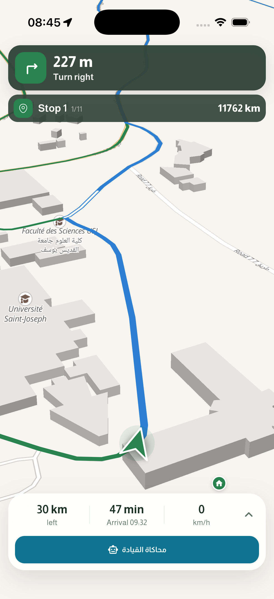 | 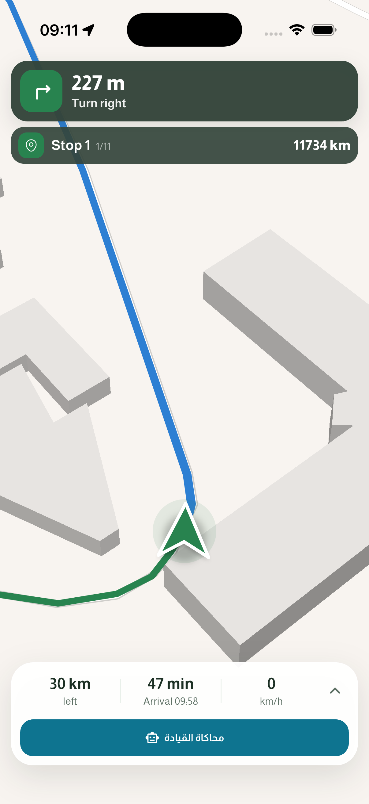 |

The camera profile interpolates between these anchors. Forward distance is scaled down for shorter viewports; the values below are for an 850-point-tall viewport.

| Speed | Zoom | Tilt | Distance ahead | Turn anticipation |
| --- | --- | --- | --- | --- |
| 0–10 km/h | 18.5 | 38° | 28 m | 14 m |
| 40 km/h | 17.4 | 50° | 65 m | 35 m |
| 80 km/h | 16.55 | 58° | 130 m | 65 m |
| 120+ km/h | 15.8 | 60° | 210 m | 90 m |

Controlled simulator runs with the Taxi vehicle checked acceleration, braking, bends, landscape, map exploration, and resuming follow. The original Arrow preference was restored afterwards.

| Stopped | City driving | Faster driving |
| --- | --- | --- |
| 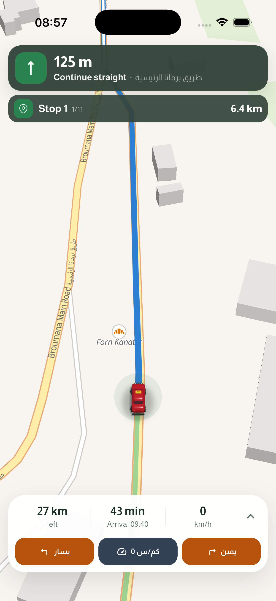 | 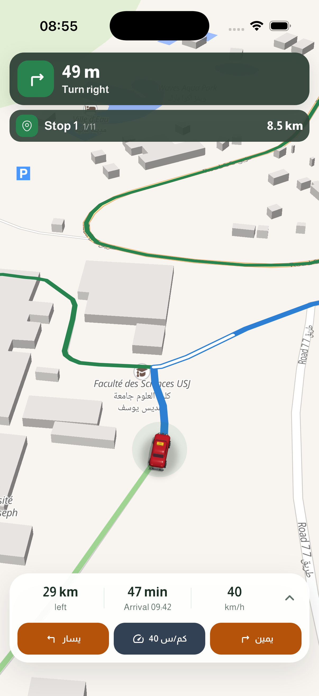 | 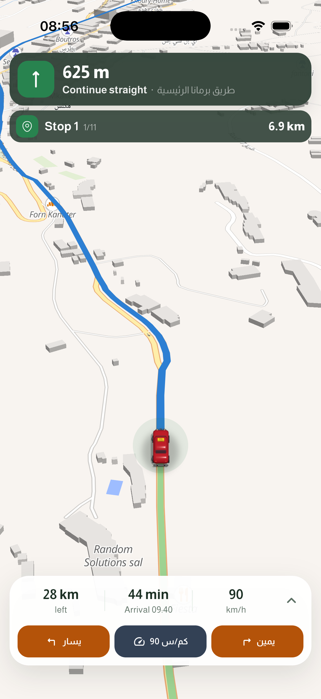 |

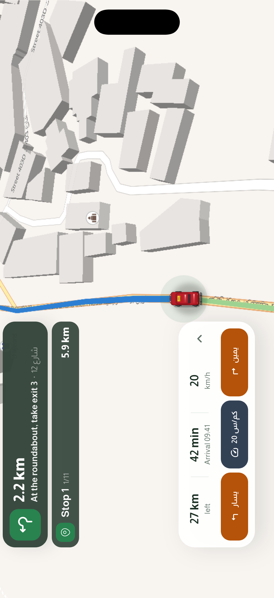

## Settings and loading preferences

| Settings overview | Delivery / pickup choices |
| --- | --- |
| 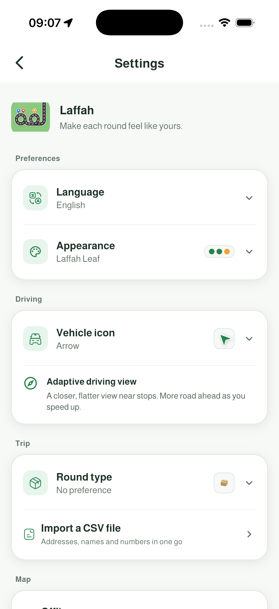 | 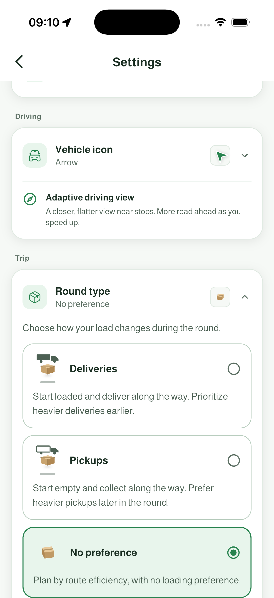 |

The new explanations describe a planning preference. They do not change the optimizer or reorder an existing route on selection.

| English | Arabic | French |
| --- | --- | --- |
| 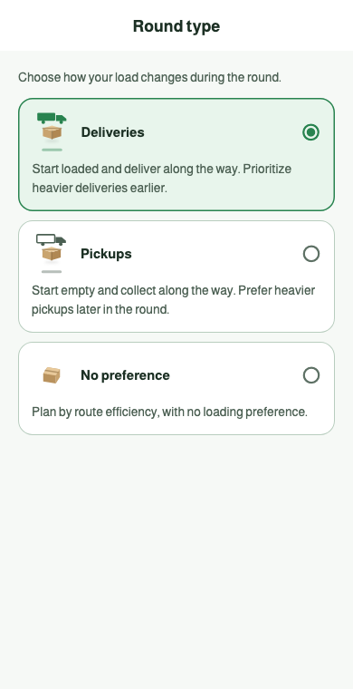 | 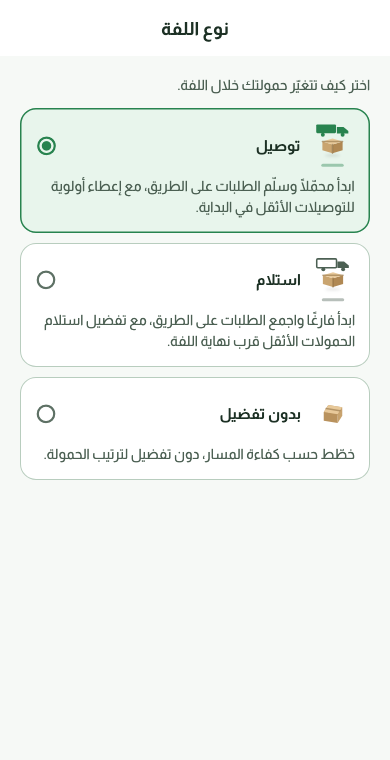 | 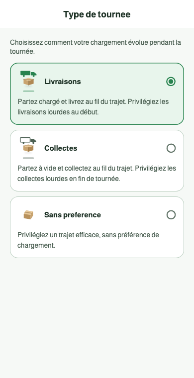 |

## Verification

- Full regression suite: **488 tests passed** (`flutter test --no-pub --reporter expanded`), including the reviewed visual references.
- 16 new tests cover camera continuity, invalid speeds, viewport offsets, braking, timing-independent easing, radio accessibility, preference persistence, and settings at 180% text in English, Arabic and French.
- Static analysis reports only the five existing findings: one unused optional parameter and four test-file comment notices. No new findings.
- iPhone 17 / iOS 26.5: native map checked at 0, 20, 40, 60 and 90 km/h, including portrait/landscape and pan/re-center behavior. Vehicle controls and load selection were exercised; the original Arrow and No preference choices were restored.
- The revised app is running in the simulator. No real-road GPS or physical Android-device validation was performed.
- One stale Arabic planning-button golden from the previous button-height correction was refreshed after confirming the current button's compact layout.

The store version remains `1.0.4+5`; this work does not create a store release. GitHub upload remains pending the repository approval requested in the earlier pass.
