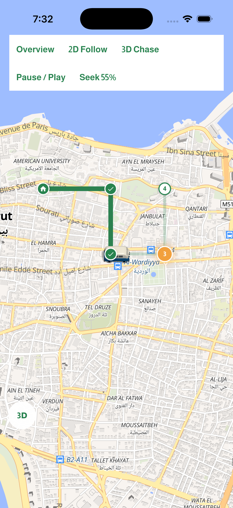
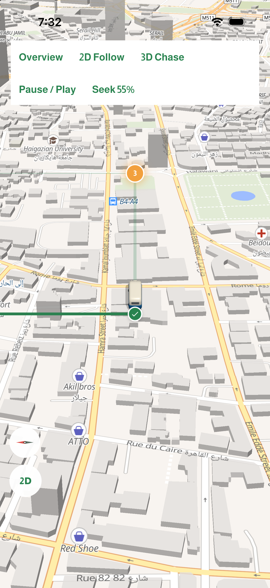

# Navigation and delivery UX — 1.0.6

Base: `origin/1.0.6` at `355a229`. Fetched and pulled with `--ff-only`.
The pre-existing `V1.0.4` version edit was preserved in the Git stash named
`codex: preserve local V1.0.4 version before 1.0.6 fixes`.

## Behavior

- Arrival offers **Delivered** (two thirds of the available row) and
  **Couldn't deliver** (one third). Each explains that it advances to the
  next stop, or finishes the trip at the final destination. Call and WhatsApp
  remain separate actions when a phone number exists.
- Completing a stop commits its outcome, next target, cleared arrival state,
  and fresh distances together. Old arrival instructions cannot survive the
  transition. Skipped stops show a red X in the map and trip timeline.
- Callbacks are scoped to the displayed stop and route; rapid repeated taps,
  stale confirmation dialogs, GPS starts, and reroute results cannot advance
  or replace a newer navigation state.
- GPS matching is constrained to the active leg, with recent progress and
  moving heading resolving repeated streets and U-turns. Route endpoints and
  projected maneuver positions use consistent arc-length fractions. Reroutes
  include the connector back to the road in stop and maneuver distances.
- Early completion retains necessary upcoming road turns while retiring the
  skipped stop's arrival instruction. Debug stepping also waits at each stop
  for a delivery outcome.
- Offline status is visible on entry and during navigation. Checks use bounded
  service reachability, run every 15 seconds while foregrounded, and refresh
  on resume/retry. A cached trip remains navigable across multiple stops;
  requesting re-optimization offline leaves the active trip intact.
- Preview vehicle and camera share a display clock and coalesced native frame
  updates. Pause/speed changes are observed immediately; turning and baked
  vehicle image changes use smoothing and hysteresis.
- Single-destination details can be dragged or tapped closed and reopened.
  Compact mode retains the destination and Go button. Map controls track the
  measured sheet extent. Arabic, English, French, enlarged text and short
  landscape layouts are covered.

## Validation on 2026-09-21

- 427 route-planner/navigation tests passed, plus 4 added delivery-outcome
  tests (431 total).
- 7 destination preview cases and 5 arrival/focus preview cases passed against
  visually inspected snapshots (12 cases).
- `dart analyze` on every changed/new Dart file: **No issues found**.
- `git diff --check`: clean.
- Native iOS simulator smoke exercised the actual MapLibre renderer with a
  temporary synthetic-route entrypoint: 2D follow, 3D chase, pause, seek,
  flattening, free exploration and recenter all passed. The normal app's
  account gate prevented reaching its planner without signing in; no account
  or trial settings were changed.

The native captures below show the temporary test controls and synthetic route:




### Reproducing focused checks

```sh
python3 scripts/prepare_public_config.py
flutter pub get
flutter test --no-pub test/route_planner test/navigation_engine_test.dart
flutter test --no-pub test/navigator_shape_preview_test.dart --plain-name 'one destination'
flutter test --no-pub test/trip_flow_preview_test.dart --name 'arrived|focus mode at the stop'
```

The project and Share Extension now require iOS 15.0, matching the minimum
accepted by the installed Xcode 27 SDK. `ios/Podfile` applies the same minimum
to every Pod target after Flutter's build-settings helper, including plugin
privacy resource bundles, while preserving any higher dependency minimum.
The CocoaPods lockfile records the complete installed dependency graph.

The ordinary selected-device launch was verified successfully with Flutter
3.41.9 and Xcode 27, without deployment or architecture command-line overrides:

```sh
flutter run -d 86ABDA74-CA0F-4041-979E-E140DC61A03C
```

The build and launch smoke used `--no-resident` to return after installation and
startup. The app displayed its existing account gate normally. iOS 14 is no
longer a supported deployment target.

A generic multi-architecture simulator build is still affected by the installed
Flutter/lipo combination; the verified workflow selects a concrete simulator.

## Offline and device limits

Offline navigation uses an already planned/restored route and the map tiles
previously downloaded or cached on the device. New search, route optimization
and off-route recalculation need a connection. Uncached map areas can be blank;
the existing offline-map download controls prepare those areas in advance.

Simulator and synthetic-GPS tests do not replace a mounted-phone road test.
Before distributing a release, check real GPS accuracy, a multi-stop drive in
airplane mode with downloaded maps, return-to-depot completion, and recovery
when coverage returns. No store upload or remote Git push is part of this change.

## Driving startup and simulator GPS — 2026-09-22

The Start driving action previously waited silently for a fresh GPS fix. On a
simulator without an active simulated location, acquisition timed out and its
error was hidden by the route summary. Start driving and the single-destination
Go button now expose a localized, accessible waiting state and reject repeated
taps. A recent OS fix (at most 10 seconds old, accuracy at most 40 metres) allows
an immediate start; otherwise acquisition has an 8-second Dart/platform deadline
and a visible retryable error. Permission is checked before accepting a cached
fix. Cached route geometry or the route origin is never used as a pretend GPS
position in the application.

Canceling or editing the route clears the waiting state and invalidates late
acquisition callbacks. GPS subscription callbacks use a separate session
revision from route/stop changes, so delivery transitions keep receiving fixes.
Errors during acquisition or driving appear as toasts, while planning errors
retain their existing inline presentation.

Validation:

- 462 route-planner/navigation tests pass, including deadline, retry, duplicate
  tap, canceled request, cache age/accuracy, and localized busy-button cases.
- Scoped Dart analysis and `git diff --check` pass.
- Ordinary Flutter simulator build and launch succeed.
- Set the simulator location to the existing draft's departure, then tapped the
  actual Start driving button. The app entered live navigation and displayed
  directions to Stop 1; no stops were completed during this check.

To test real-GPS mode on a simulator, set a simulated location through Device
Hub/Simulator or `xcrun simctl location booted set LAT,LON`. The simulated point
should be at the route departure. Route playback is available through the
separate preview action; simulated GPS stays confined to the simulator.
