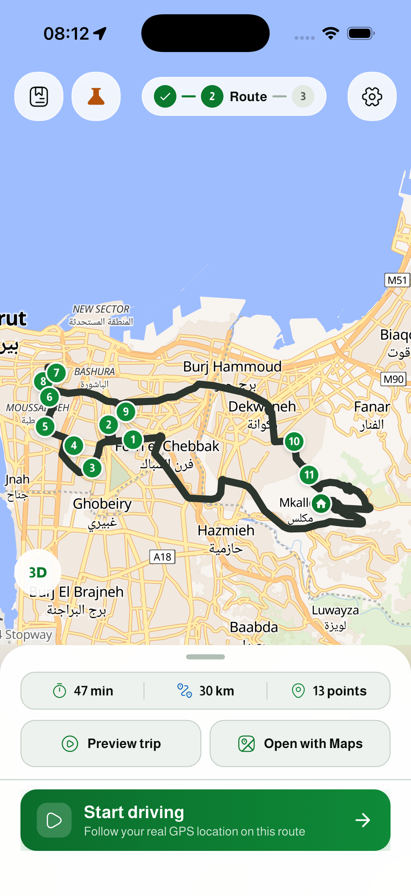
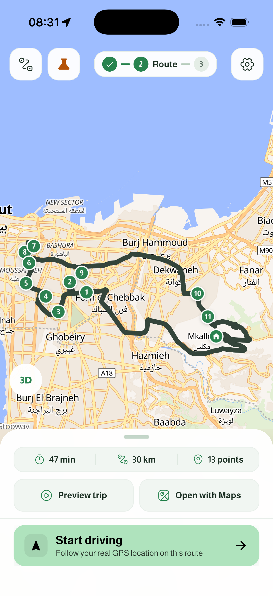
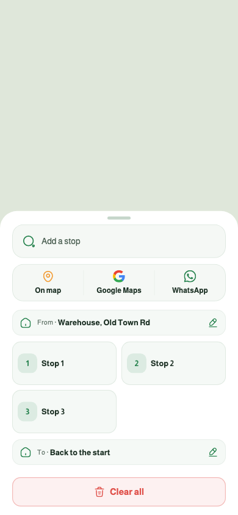
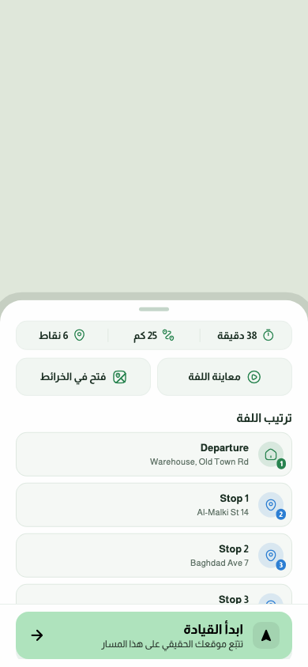

# Laffeh · UX and design refresh

Based on branch `1.0.5`, commit `8f0180a`. Work is on `design/1.0.5-ux-refresh`.

The recommended direction is a light leaf green for the main action, a deeper green for readable icons and labels, and soft neutral surfaces. This keeps the map prominent and makes the next action easier to recognize.

| Review finding | Implemented change |
| --- | --- |
| The main action felt heavy and used the same play symbol as preview. | Pale leaf action fill (`#AFE3BD`), dark text, and a navigation arrow for Start driving. |
| Three narrow stop columns truncated place names and squeezed the number into a tiny corner. | Two columns on a phone, one at larger text sizes, with readable numbered badges. |
| Dense outlines and tinted controls competed with the map. | Softer surfaces, lighter borders and shadows, coordinated metric icons, and consistent rounded map buttons. |
| Settings labels and values competed on the same line. | Icon tiles, a separate value line, and a minimum 48-point header target. |
| Some floating controls stayed white in dark mode. | Theme-aware surfaces and borders; contrasting foregrounds on main actions in all five palettes. |
| Large French text overflowed the clear action. | A wrapping label and a button that can grow vertically. |
| Leaving the preview could look up an already-deactivated widget. | Cached the extent-reporting scope and guarded deferred updates after the scope is removed. |
| Preview screenshots showed missing-glyph squares. | Loaded Material and Iconsax fonts, waited for the welcome logo to decode, excluded the live clock from the HUD fixture, and refreshed the references. |

Laffah Leaf is the default for a fresh installation. Existing saved theme selections are respected; Daylight and all dark palettes remain available. The simulator is left in Laffah Leaf.

## Simulator comparison

The same existing route before and after the refresh:

| Before | After |
| --- | --- |
|  |  |

## Planning and Arabic previews

These are widget-rendered previews; their plain background stands in for the native map.

| Planning | Arabic route summary |
| --- | --- |
|  |  |

## Validation

- Automated coverage: 472 tests, including the refreshed visual references.
- New checks cover action-text contrast (at least 4.5:1) across all five palettes, accessible button activation/loading, and a 320-point phone at 160% text size in English, Arabic and French.
- The iPhone 17 / iOS 26.5 simulator successfully built and ran the branch. Checked settings, Leaf/Graphite theme switching, preview playback and exit, and entering/exiting navigation.
- Static analysis: no new findings. The existing unused `countryCode` warning and four test-comment notices are outside this change.
- Navigation testing covers UI behavior in the simulator. Real-road GPS accuracy was not evaluated.

The branch name is `1.0.5`; the existing package version is still `1.0.4+5`. This design change does not cut a new store release.
