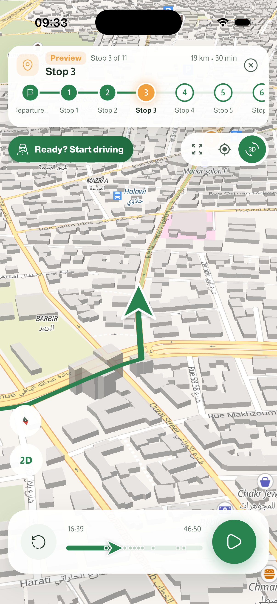
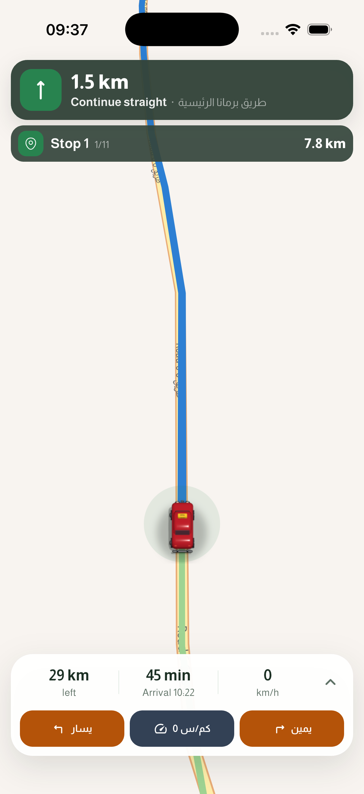
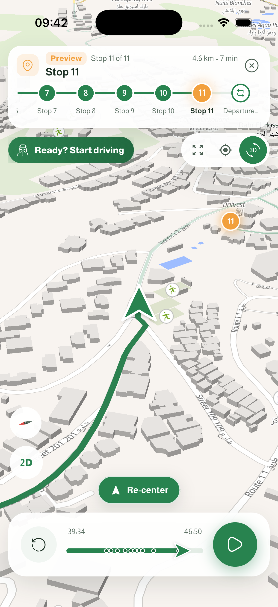

# Vehicle and route alignment follow-up

Continues the [settings and driving refresh](driving-settings-review-1.0.5.md) on `design/1.0.5-ux-refresh`. Implementation commit: `197b75a`. Both this branch and the unchanged `1.0.5` base have been pushed to the existing `DevMHZ/laffeh` remote.

## Changes

- The vehicle footprint is now **84 logical pixels in driving** (previously 72) and **64 in preview**. Arrow and the 3D vehicles use the same size configuration and image cache keys include the dimensions.
- Preview previously advanced its green trail from the playback clock while Overview eased its vehicle on another clock. Follow and Cinematic instead used a screen-centered Flutter avatar over an independently animated map. The route and avatar could visibly separate.
- Preview and driving now put the vehicle point and the route lines meeting it in **one native GeoJSON source update**, using exactly the same geographic endpoint. Delayed updates coalesce to the newest frame. Exiting queues the empty frame through the same writer, preventing stale vehicles from reappearing.
- Panning keeps the same geographic marker instead of switching between a screen overlay and a native symbol. Preview Follow/Cinematic pause camera following until Re-center; driving retains its existing three-second auto-resume after all fingers lift.
- A new driving GPS fix is compared with the preceding logical fix, rather than the extrapolated display position, to avoid treating normal prediction lead as a backward restart.
- Heading sprite images stay sharp and use a stable wheel frame, avoiding animation-driven native symbol pulsing.

## Simulator results

| Cinematic preview | Stopped driving, Taxi |
| --- | --- |
|  |  |

Native iPhone 17 / iOS 26.5 checks covered Overview, Follow, Cinematic, pausing, exiting, image selection, controlled driving through turns, and braking from 90 km/h to rest. No map-source or image errors appeared in the simulator log. The original Arrow, English, Leaf and No preference selections were restored and the saved Beirut demo route remains open.

The automated drag tool entered exploration and showed Re-center in preview but did not reliably move the native map; later driving drag attempts returned `noWindowsAvailable`. Consequently, actual gesture movement remains a manual-device check. The Re-center control was separately verified to clear the playback bar using its reported height. Geographic independence from camera rotation and exact route joins are covered by the automated tests. No physical-device GPS, Android performance, or real-road validation was performed.

## Verification

- `flutter test --no-pub --reporter expanded`: **499 tests passed**.
- Eleven new regression tests cover preview playback and rewinds, driving joins, start/arrival/end boundaries, looped routes, duplicate vertices, camera-independent geometry, missing paths, out-of-range progress, serialized writes, exit races, error recovery and disposal.
- `flutter analyze --no-pub`: only the same five existing findings (one unused optional parameter and four dangling test documentation comments). No new findings.
- Store version remains `1.0.4+5`.

## Preview controls follow-up

The 2D/3D button's camera change was overwritten by the next playback tick. Preview now retains the selected tilt until the camera mode changes. Camera updates also run one animation at a time, coalesce to the latest target, and discard queued targets on a mode change, map touch or exit. Exiting immediately cancels the follow camera, while stale style/symbol updates are ignored after the mode changes.

Exit, camera-mode selection and play/pause now keep stable control subtrees during progress updates. Exit has a 48-point target; play/pause has an accessibility label. The changed preview visual reference was inspected and refreshed.

Verification: **502 tests passed**, including three new tests on the real planner widget with a recorded native camera. They cover tilt persistence, one Exit tap while an animation is held open, and repeated mode taps with playback updates between pointer-down and pointer-up. Full static analysis has only the same five existing findings. The rebuilt iPhone simulator was checked through 2D/3D changes, replay, and one-tap exits from Overview and Cinematic playback; no new map/camera runtime errors were logged.
